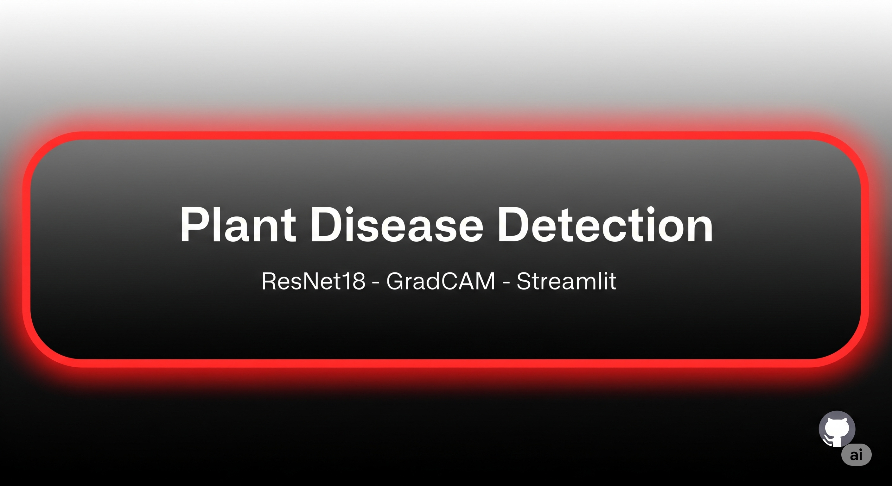
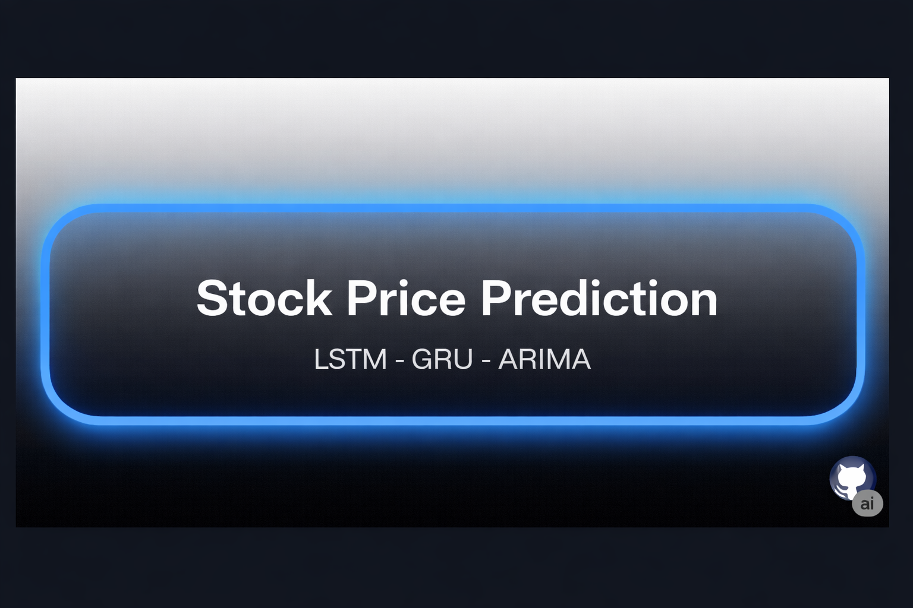
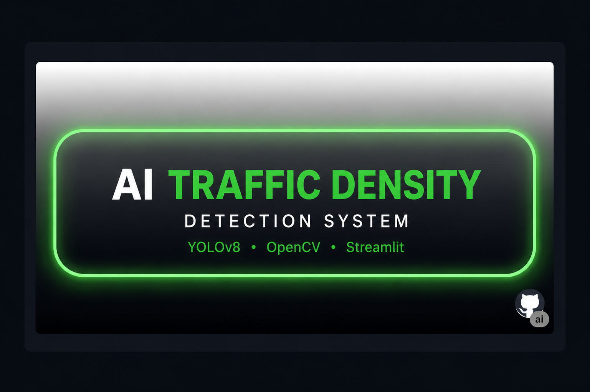

  

<h1 align="center">Hi, I'm <strong>Kumkum Solanki</strong> </h1>

  

  
  
  

---

## 🔥 About
I turn research ideas into **usable, fast demos**. Recently exploring **real‑time speech transcription**, **explainable computer vision**, and **efficient ML pipelines**.

- 🎓 B.Tech (AIML), KCC — 4th year
- 🧠 Interested in: **Whisper.cpp**, **Grad‑CAM**, **local LLMs**, and **offline‑first AI tools**
- 🤝 Open to: **SDE/ML internships**, open‑source collabs
- ⚡ Real-time speech & local AI tools
- 🔍 Explainable CV with sleek UX
- 🧪 Rapid prototyping → polished demos
- ☕ Coffee → Code → Ship → Repeat
  
---

## 🚀 Featured Projects
### 📄 ResuMatch 

ResuMatch  is a full-stack career intelligence platform designed to help job seekers analyze, improve, and optimize their resumes for better career opportunities.

The platform allows users to upload their resumes in PDF format and receive a comprehensive analysis, including ATS score, resume breakdown, missing keywords, skill gap identification, and personalized improvement suggestions.

**Tech Stack:** React, FastAPI, Python, NLP

🔗 [Live Demo](https://resumatch-1wwb.onrender.com)

###  Plant Disease Detection  

  

This project leverages deep learning to build an accurate and intuitive plant disease detection system. It utilizes a **ResNet18** model to classify plant leaf images, and integrates **Grad-CAM** to provide visual explanations of the model's predictions, making the AI's decision-making process transparent to the user. The application is deployed with **Streamlit** for a clean, user-friendly interface.  

---
### 📈 AI Stock Price Prediction System (LSTM + GRU + ARIMA)

A deep learning based financial forecasting system built using **LSTM**, **GRU**, and **ARIMA** models for multivariate time-series prediction. The project focuses on capturing long-term temporal dependencies in stock price movements by integrating **technical indicators** such as **SMA, EMA, RSI, and MACD** as input features.  

To enhance reliability, the system provides **30-day future price forecasts with confidence intervals**, along with **up/down probability estimation** to quantify directional uncertainty. A comparative evaluation is performed using **RMSE**, demonstrating the superior performance of GRU over LSTM and ARIMA.  

The entire pipeline is deployed as an **interactive Streamlit web application**, enabling users to input any stock ticker and visualize predictions, uncertainty bands, and model comparisons in real time.

---

---

### 🚦 AI Traffic Density Detection System (YOLOv8 + OpenCV + Streamlit)

An AI-powered intelligent traffic monitoring system developed using **YOLOv8**, **OpenCV**, and **Streamlit** for real-time vehicle detection and traffic density analysis. The system processes uploaded traffic videos and live webcam feeds to detect vehicles, count traffic flow, and classify congestion levels into **Low**, **Medium**, and **High** density categories.

The project includes a modern **interactive analytics dashboard** with live vehicle count metrics, traffic status indicators, emergency vehicle alerts, and dynamic traffic graphs for real-time visualization and monitoring.

To enhance traffic management capabilities, the system also performs **emergency vehicle detection simulation**, triggering instant congestion alerts to support smarter traffic monitoring and intelligent transportation systems.

The complete pipeline is deployed as an **interactive Streamlit web application**, enabling users to monitor traffic conditions, analyze congestion trends, and visualize live detection results directly from the browser in real time.

---

  

## 📫 Contact
[LinkedIn](https://www.linkedin.com/in/kumkum-solanki-892a40281/) · [Email](kumkumsolanki0111@gmail.com
)
---

Made with ❤️—A focus on a seamless user experience, including lightweight animations and Dark & Light variants.

